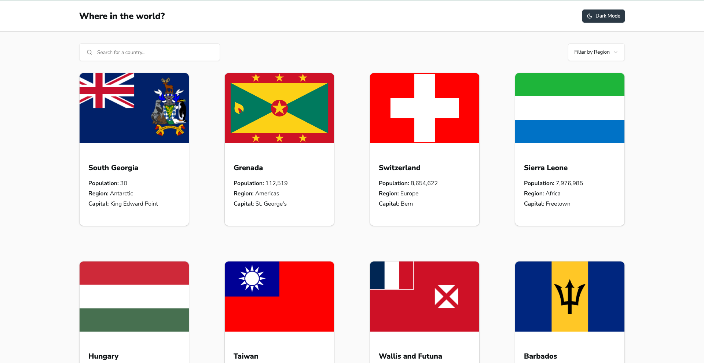
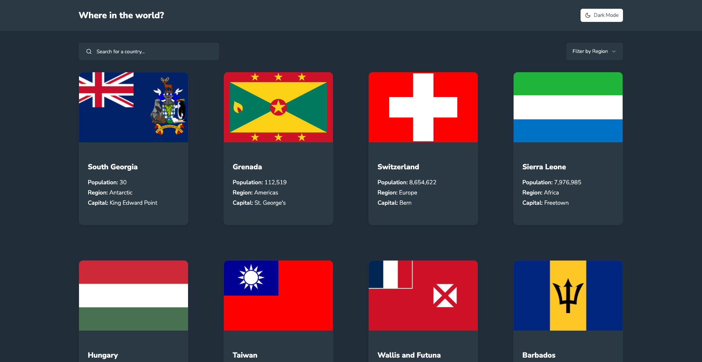
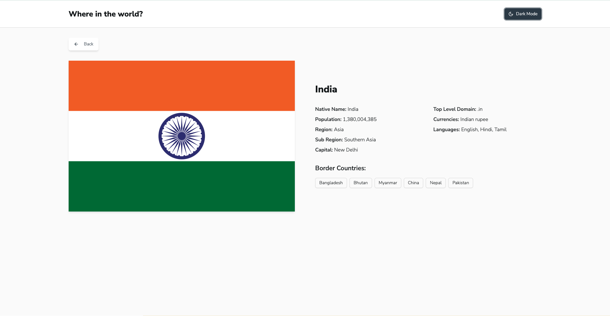
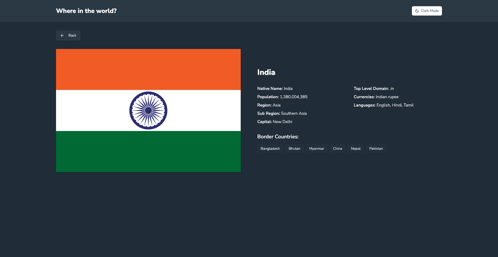

## Overview

### The challenge

Users should be able to:

- See all countries from the API on the homepage
- Search for a country using an `input` field
- Filter countries by region
- Click on a country to see more detailed information on a separate page
- Click through to the border countries on the detail page
- Toggle the color scheme between light and dark mode

### Screenshots









### Links

- Solution URL: [GitHub Repository](https://github.com/ggsingla/fe_assignment_countries_db)
- Live Site URL: [Live Demo](https://fe-assignment-countries-db.vercel.app/)

## My process

### Built with

- React with TypeScript
- Vite for fast development and building
- React Router for navigation
- React Query (TanStack Query) for data fetching and caching
- TailwindCSS for styling
- Radix UI components for accessible UI elements (Implemented with Shadcn UI)
- Axios for API requests
- ESLint for code quality
- Vercel for deployment

### Key Features

- **Responsive Design**: Fully responsive layout that works on all device sizes
- **Dark Mode**: Toggle between light and dark themes
- **Search Functionality**: Real-time search across all countries
- **Region Filtering**: Filter countries by continent/region
- **Detailed Country View**: Comprehensive information about each country
- **Border Countries Navigation**: Easy navigation to neighboring countries
- **Performance Optimized**: Efficient data fetching and caching with React Query
- **Type Safety**: Full TypeScript support for better development experience
- **Loading States**: Loading skeletons and error handling

### Project Structure

```
src/
├── api/         # API integration and data fetching
├── assets/      # Static assets like images
├── components/  # Reusable UI components
├── lib/         # Utility functions and configurations
├── pages/       # Page components
├── App.tsx      # Main application component
└── main.tsx     # Application entry point
```

### Getting Started

1. Clone the repository
2. Install dependencies:
   ```bash
   yarn install
   ```
3. Start the development server:
   ```bash
   yarn dev
   ```
4. Build for production:
   ```bash
   yarn build
   ```

### API Integration

The application uses the REST Countries API to fetch country data. The API integration is handled through React Query for efficient data fetching, caching, and state management.
